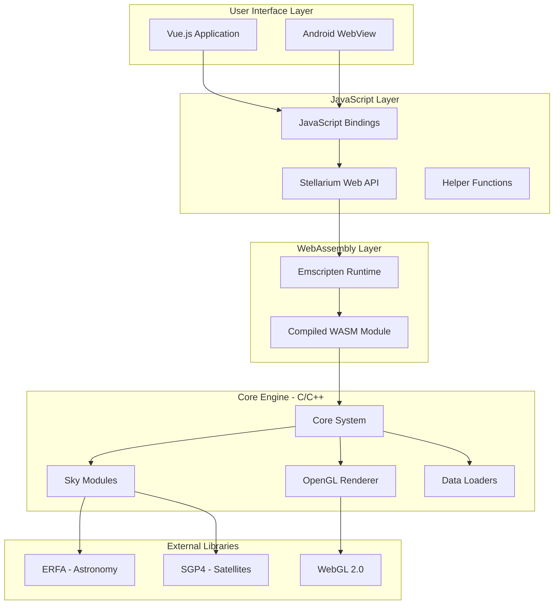
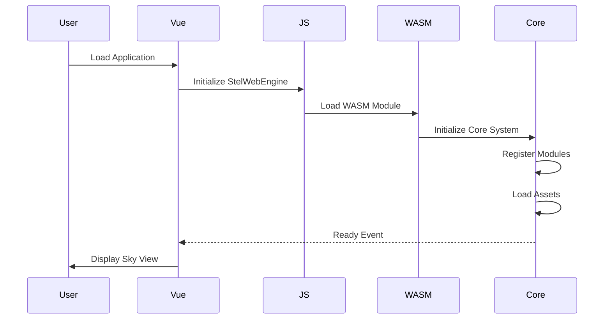
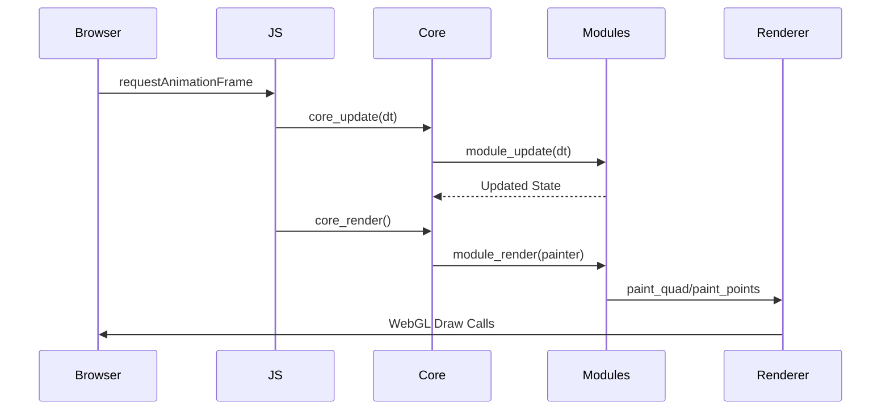
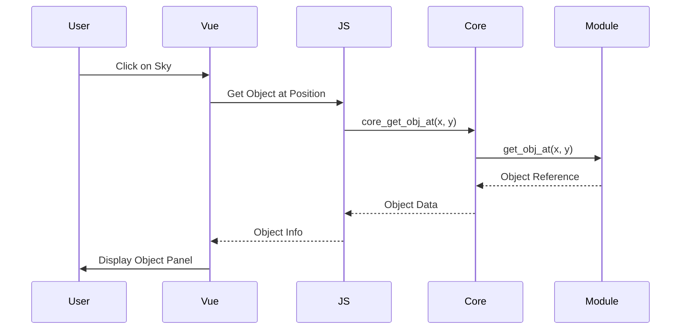

# Architecture Overview

This document provides a comprehensive overview of the Stellarium Web Engine architecture, design patterns, and component relationships.

## System Architecture

Stellarium Web Engine is a multi-layered system that combines a high-performance C/C++ rendering engine with a modern web frontend:



## Core Components

### 1. C/C++ Engine Core

The core engine is written in C/C++ and compiled to WebAssembly using Emscripten. It provides:

- **Object-Oriented System**: Custom OOP implementation in C
- **Module Architecture**: Pluggable sky object modules
- **Rendering Pipeline**: OpenGL-based rendering with projections
- **Astronomical Calculations**: Integration with ERFA library
- **Data Management**: Asset loading and caching

**Key Files:**
- [`src/core.c`](file:///d:/test/stellarium-web-engine-master/src/core.c) - Main core system
- [`src/obj.c`](file:///d:/test/stellarium-web-engine-master/src/obj.c) - Object system implementation
- [`src/module.c`](file:///d:/test/stellarium-web-engine-master/src/module.c) - Module registration and management

### 2. Sky Modules

Each celestial object type is implemented as a module:

| Module | File | Description |
|--------|------|-------------|
| **Stars** | [`stars.c`](file:///d:/test/stellarium-web-engine-master/src/modules/stars.c) | Star rendering from HIP catalog |
| **Planets** | [`planets.c`](file:///d:/test/stellarium-web-engine-master/src/modules/planets.c) | Solar system planets and moons |
| **DSO** | [`dso.c`](file:///d:/test/stellarium-web-engine-master/src/modules/dso.c) | Deep sky objects (galaxies, nebulae) |
| **Satellites** | [`satellites.c`](file:///d:/test/stellarium-web-engine-master/src/modules/satellites.c) | Artificial satellites using SGP4 |
| **Constellations** | [`constellations.c`](file:///d:/test/stellarium-web-engine-master/src/modules/constellations.c) | Constellation lines and boundaries |
| **Atmosphere** | [`atmosphere.c`](file:///d:/test/stellarium-web-engine-master/src/modules/atmosphere.c) | Atmospheric scattering and sky color |
| **Milkyway** | [`milkyway.c`](file:///d:/test/stellarium-web-engine-master/src/modules/milkyway.c) | Milky Way rendering |
| **Landscape** | [`landscape.c`](file:///d:/test/stellarium-web-engine-master/src/modules/landscape.c) | Ground and horizon rendering |

### 3. Rendering System

The rendering system uses OpenGL ES 2.0/WebGL 2.0:

**Components:**
- **Painter** ([`painter.c`](file:///d:/test/stellarium-web-engine-master/src/painter.c)) - High-level rendering API
- **Projections** ([`src/projections/`](file:///d:/test/stellarium-web-engine-master/src/projections/)) - Various projection systems
- **Renderer** ([`render_gl.c`](file:///d:/test/stellarium-web-engine-master/src/render_gl.c)) - Low-level OpenGL implementation
- **Shader Cache** ([`shader_cache.c`](file:///d:/test/stellarium-web-engine-master/src/shader_cache.c)) - Shader compilation and caching

**Supported Projections:**
- Perspective
- Stereographic
- Mercator
- Toast (HiPS)
- Healpix (HiPS)

### 4. JavaScript/WebAssembly Interface

The interface layer bridges JavaScript and C/C++:

**Key Files:**
- [`src/js/pre.js`](file:///d:/test/stellarium-web-engine-master/src/js/pre.js) - Pre-initialization code
- [`src/js/obj.js`](file:///d:/test/stellarium-web-engine-master/src/js/obj.js) - Object wrapper
- [`src/js/canvas.js`](file:///d:/test/stellarium-web-engine-master/src/js/canvas.js) - Canvas integration
- [`src/js/geojson.js`](file:///d:/test/stellarium-web-engine-master/src/js/geojson.js) - GeoJSON support

**Build Output:**
- `stellarium-web-engine.js` - JavaScript module
- `stellarium-web-engine.wasm` - WebAssembly binary

### 5. Vue.js Frontend

Modern single-page application built with Vue.js 2.6:

**Architecture:**
- **Component-Based**: Modular UI components
- **State Management**: Vuex store for global state
- **Routing**: Vue Router for navigation
- **UI Framework**: Vuetify 2.x for Material Design

**Key Components:**
- [`App.vue`](file:///d:/test/stellarium-web-engine-master/apps/web-frontend/src/App.vue) - Root application component
- [`search-panel.vue`](file:///d:/test/stellarium-web-engine-master/apps/web-frontend/src/components/search-panel.vue) - Search interface
- [`selected-object-info.vue`](file:///d:/test/stellarium-web-engine-master/apps/web-frontend/src/components/selected-object-info.vue) - Object details display
- [`settings-panel.vue`](file:///d:/test/stellarium-web-engine-master/apps/web-frontend/src/components/settings-panel.vue) - Application settings

## Design Patterns

### Object-Oriented C

The engine uses a custom OOP system in C:

```c
// Base object type
typedef struct obj_t {
    obj_klass_t *klass;
    obj_t *parent;
    char id[256];
    int ref_count;
    // ... other fields
} obj_t;

// Class definition
typedef struct obj_klass_t {
    const char *id;
    size_t size;
    int (*init)(obj_t *obj, json_value *args);
    int (*update)(obj_t *obj, double dt);
    int (*render)(const obj_t *obj, const painter_t *painter);
    // ... other methods
} obj_klass_t;
```

**Inheritance:**
All objects inherit from `obj_t` by placing it as the first field:

```c
typedef struct stars_t {
    obj_t obj;  // Inheritance
    // ... star-specific fields
} stars_t;
```

### Module Registration

Modules are automatically registered using GCC constructor attributes:

```c
static int stars_init(obj_t *obj, json_value *args) {
    // Initialization code
    return 0;
}

static obj_klass_t stars_klass = {
    .id = "stars",
    .size = sizeof(stars_t),
    .init = stars_init,
    .render = stars_render,
    // ... other methods
};

MODULE_REGISTER(stars_klass)
```

### Attribute System

Dynamic attributes provide JavaScript access and type conversion:

```c
ATTR("longitude", .offset = offsetof(observer_t, elong), .base = "f")
```

Access from JavaScript:
```javascript
const longitude = stel.observer.longitude
stel.observer.longitude = 1.4  // radians
```

### Painter Pattern

The painter provides a high-level rendering abstraction:

```c
int paint_quad(const painter_t *painter,
               texture_t *tex,
               double uv[4][2],
               const projection_t *proj,
               int grid_size);
```

This separates rendering logic from projection and transformation details.

## Data Flow

### Initialization Flow



### Rendering Loop



### Object Selection Flow



## Coordinate Systems

The engine uses multiple coordinate reference frames:

### Frame Transformations

```
ICRF (J2000.0) ← Catalog coordinates
    ↓ Precession/Nutation
Observed ICRF
    ↓ Aberration
Geocentric
    ↓ Observer position
Topocentric
    ↓ Refraction
Horizontal (Alt/Az)
    ↓ Projection
Screen (x, y)
```

**Key Files:**
- [`frames.c`](file:///d:/test/stellarium-web-engine-master/src/frames.c) - Frame transformation matrices
- [`observer.c`](file:///d:/test/stellarium-web-engine-master/src/observer.c) - Observer position and time

## Build System

### Emscripten Build

The C/C++ engine is compiled to WebAssembly:

**Build Tool:** SCons ([`SConstruct`](file:///d:/test/stellarium-web-engine-master/SConstruct))

**Build Modes:**
- `debug` - Debugging symbols, assertions, tests
- `release` - Optimized, no debug info
- `profile` - Profiling enabled

**Command:**
```bash
make js  # Builds stellarium-web-engine.js and .wasm
```

### Frontend Build

The Vue.js application uses Vue CLI:

**Build Tool:** Vue CLI ([`vue.config.js`](file:///d:/test/stellarium-web-engine-master/apps/web-frontend/vue.config.js))

**Commands:**
```bash
npm run dev      # Development server
npm run build    # Production build
npm run lint     # Code linting
```

### Android Build

Mobile app uses Capacitor:

**Build Tool:** Gradle ([`build.gradle`](file:///d:/test/stellarium-web-engine-master/apps/web-frontend/android/build.gradle))

**Commands:**
```bash
npm run android:build  # Build and sync to Android
npx cap open android   # Open in Android Studio
```

## Performance Considerations

### WebAssembly Optimization

- **-O3 optimization** for maximum performance
- **Memory growth** enabled for dynamic allocation
- **Table growth** for function pointers
- **No filesystem** to reduce bundle size

### Rendering Optimization

- **Frustum culling** - Only render visible objects
- **Level-of-detail** - Adaptive detail based on zoom
- **Tile caching** - HiPS tiles cached in memory
- **Shader caching** - Compiled shaders reused

### Data Loading

- **Lazy loading** - Load data on demand
- **Progressive loading** - HiPS tiles load progressively
- **Compression** - Data files gzipped
- **Indexing** - Fast search via pre-built indices

## Threading Model

> [!IMPORTANT]
> WebAssembly currently runs on the main thread. All rendering and calculations are synchronous.

**Implications:**
- Heavy calculations can block UI
- Data loading should be chunked
- Use `requestAnimationFrame` for smooth rendering

## Error Handling

### C/C++ Layer

```c
// Return codes: 0 = success, non-zero = error
int result = some_function();
if (result != 0) {
    LOG_E("Function failed: %d", result);
    return result;
}
```

### JavaScript Layer

```javascript
try {
    const result = stel.core.someMethod()
} catch (error) {
    console.error('Engine error:', error)
}
```

## Extension Points

### Adding New Modules

1. Create module file in `src/modules/`
2. Implement `obj_klass_t` with required methods
3. Use `MODULE_REGISTER` macro
4. Rebuild engine

### Adding Custom Projections

1. Create projection file in `src/projections/`
2. Implement projection functions
3. Register in projection system
4. Rebuild engine

### Frontend Customization

1. Add Vue components in `src/components/`
2. Register in `App.vue` or router
3. Use Vuex for state management
4. Rebuild frontend

## Security Considerations

- **CORS** - Assets must be served with proper CORS headers
- **CSP** - Content Security Policy for WebAssembly
- **Input validation** - All user inputs validated
- **Data sanitization** - External data sanitized before use

---

**Next Steps:**
- Read [Engine Internals](ENGINE_INTERNALS.md) for C/C++ implementation details
- See [Frontend Guide](FRONTEND_GUIDE.md) for Vue.js development
- Check [API Reference](API_REFERENCE.md) for available interfaces
